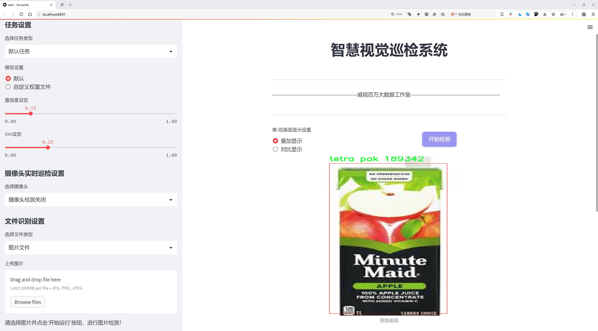
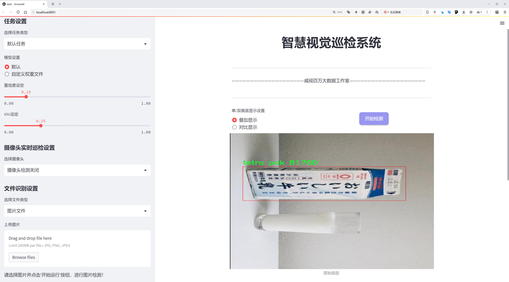
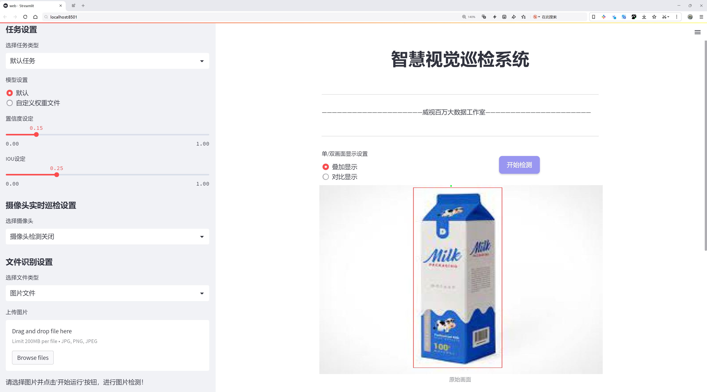
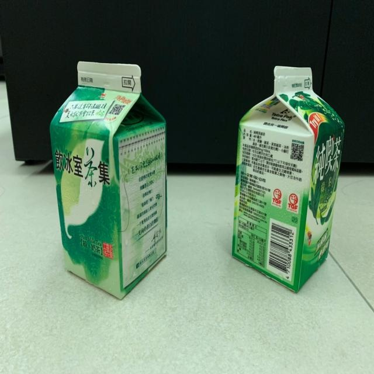
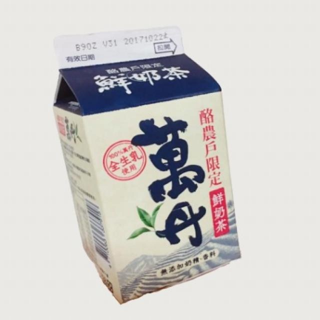
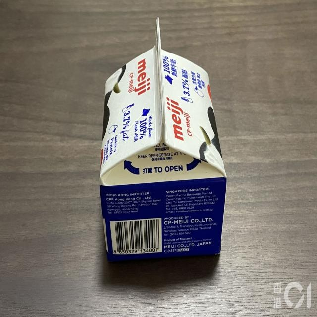
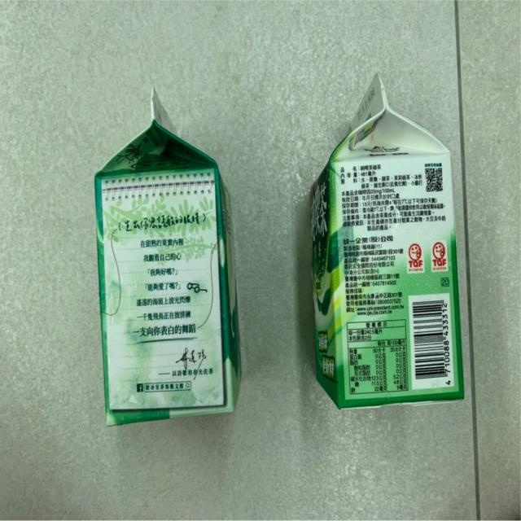
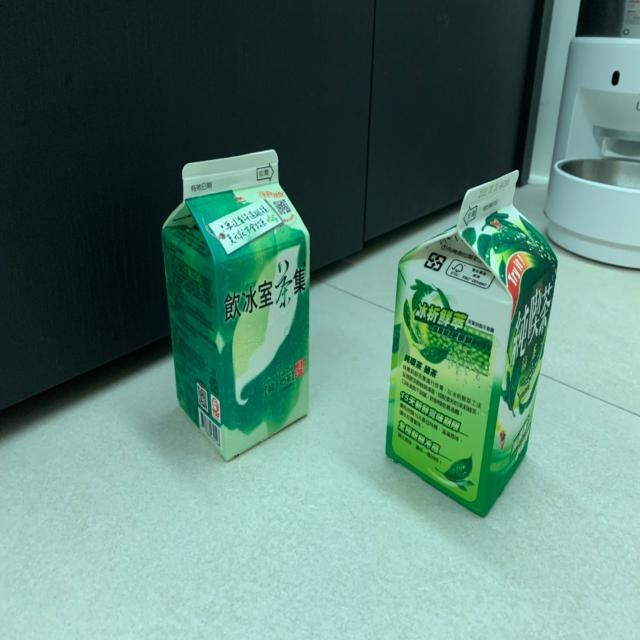

# 包装材料回收分类检测系统源码分享
 # [一条龙教学YOLOV8标注好的数据集一键训练_70+全套改进创新点发刊_Web前端展示]

### 1.研究背景与意义

项目参考[AAAI Association for the Advancement of Artificial Intelligence](https://gitee.com/qunmasj/projects)

项目来源[AACV Association for the Advancement of Computer Vision](https://kdocs.cn/l/cszuIiCKVNis)

研究背景与意义

随着全球经济的快速发展和城市化进程的加速，包装材料的使用量急剧增加，随之而来的环境问题也日益严重。尤其是一次性包装材料的广泛应用，导致了大量的固体废弃物产生，给生态环境带来了巨大的压力。根据统计数据，包装材料占据了城市固体废物的相当一部分，其中纸质和塑料包装材料尤为突出。为了应对这一挑战，包装材料的回收利用显得尤为重要。通过有效的回收分类，不仅可以减少资源浪费，还能降低环境污染。因此，构建一个高效的包装材料回收分类系统，成为了当前环境保护和资源再利用领域的重要研究方向。

在这一背景下，计算机视觉技术的快速发展为包装材料的自动化分类提供了新的解决方案。YOLO（You Only Look Once）系列目标检测算法因其高效性和准确性，已被广泛应用于各类物体检测任务。YOLOv8作为该系列的最新版本，进一步提升了检测精度和速度，尤其在复杂环境下的物体识别能力得到了显著增强。然而，针对特定领域的应用，尤其是包装材料的回收分类，仍然存在一些挑战。例如，包装材料的种类繁多，形态各异，且在实际应用中可能存在重叠、遮挡等情况，这对目标检测算法提出了更高的要求。因此，基于改进YOLOv8的包装材料回收分类系统的研究，具有重要的理论价值和实际意义。

本研究将利用一个包含1700张图像的数据集，该数据集涵盖了七个类别的包装材料，包括不同类型的纸箱、纸质材料、塑料以及特定的Tetra Pak包装。这些类别的多样性为模型的训练提供了丰富的样本，有助于提高模型的泛化能力和分类准确率。通过对YOLOv8模型的改进，结合数据集的特征，旨在提升模型在复杂场景下的检测性能，尤其是在低光照、背景杂乱等不利条件下的表现。此外，研究还将探索如何通过数据增强、迁移学习等技术，进一步提升模型的鲁棒性和适应性。

本研究的意义不仅在于推动包装材料回收分类技术的发展，更在于为环境保护提供切实可行的技术支持。通过构建高效的自动化分类系统，可以显著提高回收效率，降低人工成本，从而促进资源的循环利用，减轻环境负担。同时，研究成果也将为相关领域的研究提供参考，推动智能垃圾分类、环境监测等领域的技术进步。综上所述，基于改进YOLOv8的包装材料回收分类系统的研究，具有重要的学术价值和社会意义，必将为实现可持续发展目标贡献一份力量。

### 2.图片演示







##### 注意：由于此博客编辑较早，上面“2.图片演示”和“3.视频演示”展示的系统图片或者视频可能为老版本，新版本在老版本的基础上升级如下：（实际效果以升级的新版本为准）

  （1）适配了YOLOV8的“目标检测”模型和“实例分割”模型，通过加载相应的权重（.pt）文件即可自适应加载模型。

  （2）支持“图片识别”、“视频识别”、“摄像头实时识别”三种识别模式。

  （3）支持“图片识别”、“视频识别”、“摄像头实时识别”三种识别结果保存导出，解决手动导出（容易卡顿出现爆内存）存在的问题，识别完自动保存结果并导出到tempDir中。

  （4）支持Web前端系统中的标题、背景图等自定义修改，后面提供修改教程。

  另外本项目提供训练的数据集和训练教程,暂不提供权重文件（best.pt）,需要您按照教程进行训练后实现图片演示和Web前端界面演示的效果。

### 3.视频演示

[3.1 视频演示](https://www.bilibili.com/video/BV1dfxueyEqz/)

### 4.数据集信息展示

##### 4.1 本项目数据集详细数据（类别数＆类别名）

nc: 1
names: ['tetra pak']


##### 4.2 本项目数据集信息介绍

数据集信息展示

在当今环境保护意识日益增强的背景下，包装材料的回收利用成为了一个重要的研究领域。为了有效推动这一领域的发展，我们构建了一个专门用于训练改进YOLOv8的包装材料回收分类系统的数据集，命名为“tetra pak”。该数据集的主要目标是通过深度学习技术，提升对特定包装材料的识别和分类能力，从而为回收工作提供更为精准的支持。

“tetra pak”数据集的设计旨在聚焦于一种特定的包装材料，即Tetra Pak。Tetra Pak是一种广泛应用于液体食品包装的材料，以其优良的防潮、防氧化和保鲜性能而受到青睐。然而，随着其使用量的增加，如何有效回收和再利用这一材料成为了亟待解决的问题。因此，构建一个高效的分类系统显得尤为重要。

该数据集包含了丰富的Tetra Pak包装材料的图像数据，经过精心标注，确保每一张图像都能为模型的训练提供准确的信息。数据集中包含的类别数量为1，具体类别为“tetra pak”。这一单一类别的设计使得模型能够专注于识别和分类Tetra Pak材料，从而提高其在实际应用中的效率和准确性。尽管类别数量较少，但数据集中的图像涵盖了多种不同角度、光照条件和背景环境下的Tetra Pak包装材料，确保了模型在多样化场景中的适应能力。

在数据集的构建过程中，我们特别注重图像的多样性和代表性。通过收集来自不同来源的Tetra Pak包装材料图像，包括超市、便利店和家庭等场景，我们力求使数据集能够真实反映出Tetra Pak材料在日常生活中的实际情况。此外，为了增强模型的鲁棒性，我们还对图像进行了多种数据增强处理，如旋转、缩放、裁剪和颜色变换等。这些处理不仅增加了数据集的规模，也提高了模型在面对不同条件下的识别能力。

在训练过程中，改进YOLOv8模型将利用这一数据集进行特征学习和参数优化。YOLOv8作为一种先进的目标检测算法，具备高效的实时检测能力和优越的精度表现，适合用于包装材料的自动分类任务。通过对“tetra pak”数据集的训练，模型将能够在实际应用中快速识别Tetra Pak包装材料，并将其与其他类型的包装材料区分开来，为后续的回收处理提供重要的支持。

总之，“tetra pak”数据集的构建不仅为改进YOLOv8的包装材料回收分类系统提供了坚实的基础，也为推动Tetra Pak材料的回收利用提供了新的思路。随着该系统的不断优化和完善，我们期待能够在实际应用中实现更高效的包装材料分类，从而为环境保护贡献一份力量。











### 5.全套项目环境部署视频教程（零基础手把手教学）

[5.1 环境部署教程链接（零基础手把手教学）](https://www.ixigua.com/7404473917358506534?logTag=c807d0cbc21c0ef59de5)


[5.2 安装Python虚拟环境创建和依赖库安装视频教程链接（零基础手把手教学）](https://www.ixigua.com/7404474678003106304?logTag=1f1041108cd1f708b01a)

### 6.手把手YOLOV8训练视频教程（零基础小白有手就能学会）

[6.1 手把手YOLOV8训练视频教程（零基础小白有手就能学会）](https://www.ixigua.com/7404477157818401292?logTag=d31a2dfd1983c9668658)

### 7.70+种全套YOLOV8创新点代码加载调参视频教程（一键加载写好的改进模型的配置文件）

[7.1 70+种全套YOLOV8创新点代码加载调参视频教程（一键加载写好的改进模型的配置文件）](https://www.ixigua.com/7404478314661806627?logTag=29066f8288e3f4eea3a4)

### 8.70+种全套YOLOV8创新点原理讲解（非科班也可以轻松写刊发刊，V10版本正在科研待更新）

由于篇幅限制，每个创新点的具体原理讲解就不一一展开，具体见下列网址中的创新点对应子项目的技术原理博客网址【Blog】：


[8.1 70+种全套YOLOV8创新点原理讲解链接](https://gitee.com/qunmasj/good)

### 9.系统功能展示（检测对象为举例，实际内容以本项目数据集为准）

图9.1.系统支持检测结果表格显示

  图9.2.系统支持置信度和IOU阈值手动调节

  图9.3.系统支持自定义加载权重文件best.pt(需要你通过步骤5中训练获得)

  图9.4.系统支持摄像头实时识别

  图9.5.系统支持图片识别

  图9.6.系统支持视频识别

  图9.7.系统支持识别结果文件自动保存

  图9.8.系统支持Excel导出检测结果数据


### 10.原始YOLOV8算法原理

原始YOLOv8算法原理

YOLOv8算法作为目标检测领域的最新进展，承载着YOLO系列算法的演变与创新，展现了其在高效性与准确性方面的卓越性能。该算法的设计理念始终围绕着实时性和准确性展开，旨在为各种计算机视觉任务提供一种灵活且高效的解决方案。YOLOv8在多个方面进行了优化，特别是在网络结构、损失函数和样本匹配策略等方面，力求在保证模型轻量化的同时，提升目标检测的精度和速度。

首先，YOLOv8的网络结构设计遵循了分层次的架构，包括输入层、主干网络和检测头。输入层的图像尺寸默认设置为640x640，但为了适应不同长宽比的图像，YOLOv8采用了自适应缩放策略。这种策略通过将长边按比例缩小到指定尺寸，并对短边进行填充，尽量减少信息冗余，从而提高了目标检测的速度和准确性。此外，在训练过程中，YOLOv8引入了Mosaic数据增强技术，通过将四张图像随机缩放并拼接成一张新的训练样本，促使模型学习到更多的特征和上下文信息，进一步提升了模型的鲁棒性。

在主干网络部分，YOLOv8对YOLOv5中的C3模块进行了重要的改进，采用了C2F模块。这一新模块不仅保留了CSPNet的分流思想，还通过增加更多的残差连接，增强了梯度流的丰富性，使得模型在保持轻量化的同时，能够获得更高的精度和更合理的延迟。C2F模块的设计灵感部分来源于YOLOv7中的ELAN模块，二者的结合使得YOLOv8在特征提取上表现得更加出色。

在Neck部分，YOLOv8继续采用特征金字塔网络（FPN）结构，但对上采样阶段进行了简化，去除了多余的卷积层，直接对不同阶段输出的特征进行上采样。这一改进不仅减少了计算复杂度，还加快了特征融合的速度，使得模型在处理复杂场景时能够更迅速地做出反应。

YOLOv8的Head部分则是其最大的创新之一，采用了解耦合头结构，将分类和检测任务分开处理。传统的耦合头结构在处理目标检测时，分类和边界框回归共享同一卷积层，这在一定程度上限制了模型的灵活性和性能。YOLOv8通过引入解耦合头结构，分别为分类和边界框回归设计了独立的卷积路径，使得模型能够更专注于各自的任务，提高了检测精度。

在损失函数的设计上，YOLOv8也进行了重要的创新。它使用了BCELoss作为分类损失，并结合DFLLoss和CIoULoss作为回归损失。DFLLoss旨在帮助模型更快地聚焦于标签附近的区域，而CIoULoss则通过考虑边界框的重叠程度，进一步提升了回归精度。这种新的损失策略使得YOLOv8在训练过程中能够更有效地学习到目标的特征，从而在实际应用中表现出更高的准确性。

值得一提的是，YOLOv8摒弃了传统的Anchor-Based方法，转而采用Anchor-Free的策略。这一转变使得目标检测不再依赖于预设的锚框，而是将目标检测问题转化为关键点检测问题。这种方法的优势在于其更强的泛化能力和简化的网络结构，避免了在训练前对锚框进行聚类和调整的复杂过程，使得模型在面对不同数据集时能够更加灵活。

总的来说，YOLOv8算法在多个方面进行了深度的优化与创新，展现了其在目标检测领域的强大潜力。通过引入新的网络结构、损失函数和样本匹配策略，YOLOv8不仅提升了目标检测的准确性和速度，还在实际应用中展现了更强的适应性和灵活性。这些改进使得YOLOv8成为当前目标检测领域的佼佼者，为未来的研究和应用提供了新的方向与可能性。随着YOLOv8的广泛应用，预计其将在智能监控、自动驾驶、无人机视觉等多个领域发挥重要作用，推动计算机视觉技术的进一步发展。


### 11.项目核心源码讲解（再也不用担心看不懂代码逻辑）

#### 11.1 code\ultralytics\models\yolo\segment\predict.py

以下是对代码的核心部分进行分析和详细注释的结果：

```python
# Ultralytics YOLO 🚀, AGPL-3.0 license

from ultralytics.engine.results import Results  # 导入结果处理类
from ultralytics.models.yolo.detect.predict import DetectionPredictor  # 导入检测预测器基类
from ultralytics.utils import DEFAULT_CFG, ops  # 导入默认配置和操作工具

class SegmentationPredictor(DetectionPredictor):
    """
    扩展DetectionPredictor类，用于基于分割模型的预测。

    示例用法:
        ```python
        from ultralytics.utils import ASSETS
        from ultralytics.models.yolo.segment import SegmentationPredictor

        args = dict(model='yolov8n-seg.pt', source=ASSETS)
        predictor = SegmentationPredictor(overrides=args)
        predictor.predict_cli()
        ```
    """

    def __init__(self, cfg=DEFAULT_CFG, overrides=None, _callbacks=None):
        """初始化SegmentationPredictor，设置配置、覆盖参数和回调函数。"""
        super().__init__(cfg, overrides, _callbacks)  # 调用父类构造函数
        self.args.task = "segment"  # 设置任务类型为分割

    def postprocess(self, preds, img, orig_imgs):
        """对每个输入图像批次应用非极大值抑制，并处理检测结果。"""
        # 使用非极大值抑制来过滤预测框
        p = ops.non_max_suppression(
            preds[0],  # 预测结果
            self.args.conf,  # 置信度阈值
            self.args.iou,  # IOU阈值
            agnostic=self.args.agnostic_nms,  # 是否使用类别无关的NMS
            max_det=self.args.max_det,  # 最大检测框数量
            nc=len(self.model.names),  # 类别数量
            classes=self.args.classes,  # 需要检测的类别
        )

        # 如果输入图像不是列表，则将其转换为numpy数组
        if not isinstance(orig_imgs, list):  
            orig_imgs = ops.convert_torch2numpy_batch(orig_imgs)

        results = []  # 存储结果的列表
        # 获取第二个输出，处理模型导出情况
        proto = preds[1][-1] if len(preds[1]) == 3 else preds[1]  
        
        # 遍历每个预测结果
        for i, pred in enumerate(p):
            orig_img = orig_imgs[i]  # 获取原始图像
            img_path = self.batch[0][i]  # 获取图像路径
            
            if not len(pred):  # 如果没有检测到框
                masks = None  # 设置掩码为None
            elif self.args.retina_masks:  # 如果使用Retina掩码
                # 缩放预测框
                pred[:, :4] = ops.scale_boxes(img.shape[2:], pred[:, :4], orig_img.shape)
                # 处理掩码
                masks = ops.process_mask_native(proto[i], pred[:, 6:], pred[:, :4], orig_img.shape[:2])  # HWC
            else:  # 否则使用常规掩码处理
                masks = ops.process_mask(proto[i], pred[:, 6:], pred[:, :4], img.shape[2:], upsample=True)  # HWC
                # 缩放预测框
                pred[:, :4] = ops.scale_boxes(img.shape[2:], pred[:, :4], orig_img.shape)
            
            # 将结果存储到Results对象中
            results.append(Results(orig_img, path=img_path, names=self.model.names, boxes=pred[:, :6], masks=masks))
        
        return results  # 返回处理后的结果
```

### 代码核心部分分析
1. **类定义**：`SegmentationPredictor`类继承自`DetectionPredictor`，用于实现基于分割模型的预测功能。
2. **初始化方法**：构造函数中调用父类的构造函数，并设置任务类型为“segment”。
3. **后处理方法**：`postprocess`方法用于对模型的预测结果进行后处理，包括非极大值抑制和掩码处理。根据预测结果的不同情况，分别处理掩码和框的缩放，最终将结果封装到`Results`对象中并返回。

该文件是一个用于YOLO（You Only Look Once）模型的分割预测的实现，属于Ultralytics库的一部分。它扩展了一个名为`DetectionPredictor`的类，专门用于处理图像分割任务。文件中包含了一个`SegmentationPredictor`类，该类的主要功能是进行图像分割的预测。

在类的构造函数`__init__`中，首先调用了父类的构造函数，并传入配置参数、覆盖参数和回调函数。接着，将任务类型设置为“segment”，表明该预测器是用于分割任务的。

`postprocess`方法是该类的核心功能之一。它接收预测结果、输入图像和原始图像作为参数，并对每张图像的检测结果进行后处理。具体来说，首先调用`non_max_suppression`函数对预测结果进行非极大值抑制，以去除冗余的检测框。接着，检查输入的原始图像是否为列表格式，如果不是，则将其转换为NumPy数组格式。

在处理每个预测结果时，代码会根据预测的数量和形状来处理掩膜（masks）。如果没有检测到目标，掩膜将被设置为`None`。如果启用了`retina_masks`选项，则会使用原生处理方法来生成掩膜；否则，将使用常规的掩膜处理方法。最后，所有处理后的结果将被封装成`Results`对象，并返回。

整体来看，这个文件的主要目的是为YOLO模型提供图像分割的预测功能，通过继承和扩展已有的检测预测器，增加了处理分割任务所需的特定逻辑和方法。

#### 11.2 code\ultralytics\utils\callbacks\tensorboard.py

以下是代码中最核心的部分，并附上详细的中文注释：

```python
# 导入必要的库
from ultralytics.utils import LOGGER, SETTINGS, TESTS_RUNNING, colorstr

try:
    # 尝试导入TensorBoard的SummaryWriter
    from torch.utils.tensorboard import SummaryWriter

    # 确保当前不是在测试环境中
    assert not TESTS_RUNNING  
    # 确保TensorBoard集成已启用
    assert SETTINGS["tensorboard"] is True  
    WRITER = None  # 初始化TensorBoard的SummaryWriter实例

except (ImportError, AssertionError, TypeError, AttributeError):
    # 捕获导入错误或断言错误，确保TensorBoard可用
    SummaryWriter = None  # 如果导入失败，则将SummaryWriter设置为None


def _log_scalars(scalars, step=0):
    """将标量值记录到TensorBoard中。"""
    if WRITER:  # 如果WRITER存在
        for k, v in scalars.items():  # 遍历标量字典
            WRITER.add_scalar(k, v, step)  # 记录每个标量


def _log_tensorboard_graph(trainer):
    """将模型图记录到TensorBoard中。"""
    try:
        import warnings
        from ultralytics.utils.torch_utils import de_parallel, torch

        imgsz = trainer.args.imgsz  # 获取输入图像大小
        imgsz = (imgsz, imgsz) if isinstance(imgsz, int) else imgsz  # 确保图像大小为元组
        p = next(trainer.model.parameters())  # 获取模型参数以确定设备和类型
        im = torch.zeros((1, 3, *imgsz), device=p.device, dtype=p.dtype)  # 创建一个输入图像（必须为零而不是空）

        with warnings.catch_warnings():
            warnings.simplefilter("ignore", category=UserWarning)  # 忽略JIT跟踪警告
            WRITER.add_graph(torch.jit.trace(de_parallel(trainer.model), im, strict=False), [])  # 记录模型图
    except Exception as e:
        LOGGER.warning(f"WARNING ⚠️ TensorBoard图形可视化失败 {e}")  # 记录警告信息


def on_pretrain_routine_start(trainer):
    """使用SummaryWriter初始化TensorBoard日志记录。"""
    if SummaryWriter:  # 如果SummaryWriter可用
        try:
            global WRITER
            WRITER = SummaryWriter(str(trainer.save_dir))  # 创建SummaryWriter实例
            prefix = colorstr("TensorBoard: ")
            LOGGER.info(f"{prefix}开始使用 'tensorboard --logdir {trainer.save_dir}'，可在 http://localhost:6006/ 查看。")
        except Exception as e:
            LOGGER.warning(f"WARNING ⚠️ TensorBoard未正确初始化，未记录此运行。 {e}")  # 记录警告信息


def on_train_start(trainer):
    """记录TensorBoard图形。"""
    if WRITER:  # 如果WRITER存在
        _log_tensorboard_graph(trainer)  # 记录模型图


def on_train_epoch_end(trainer):
    """在训练周期结束时记录标量统计信息。"""
    _log_scalars(trainer.label_loss_items(trainer.tloss, prefix="train"), trainer.epoch + 1)  # 记录训练损失
    _log_scalars(trainer.lr, trainer.epoch + 1)  # 记录学习率


def on_fit_epoch_end(trainer):
    """在训练周期结束时记录周期指标。"""
    _log_scalars(trainer.metrics, trainer.epoch + 1)  # 记录训练指标


# 定义回调函数字典，根据SummaryWriter的可用性选择相应的回调
callbacks = (
    {
        "on_pretrain_routine_start": on_pretrain_routine_start,
        "on_train_start": on_train_start,
        "on_fit_epoch_end": on_fit_epoch_end,
        "on_train_epoch_end": on_train_epoch_end,
    }
    if SummaryWriter
    else {}
)
```

### 代码核心部分说明：
1. **导入和初始化**：尝试导入TensorBoard的`SummaryWriter`，并确保在非测试环境中运行，同时确认TensorBoard集成已启用。
2. **记录标量**：定义了一个私有函数`_log_scalars`，用于将标量值记录到TensorBoard中。
3. **记录模型图**：定义了一个私有函数`_log_tensorboard_graph`，用于将模型的计算图记录到TensorBoard中，便于可视化。
4. **回调函数**：定义了一系列回调函数，用于在训练的不同阶段（如开始训练、结束训练周期等）进行日志记录。
5. **回调字典**：根据`SummaryWriter`的可用性构建回调字典，以便在训练过程中调用相应的日志记录函数。

这个程序文件是用于在Ultralytics YOLO项目中集成TensorBoard的回调函数，主要用于记录训练过程中的各种指标和模型图。首先，文件导入了一些必要的模块，包括日志记录器和设置参数，并尝试从PyTorch的`torch.utils.tensorboard`中导入`SummaryWriter`，这是TensorBoard的核心组件。

在导入过程中，程序会进行一些检查，确保当前不是在测试环境中运行，并且TensorBoard集成已启用。如果导入失败或条件不满足，`SummaryWriter`将被设置为`None`，以避免后续调用时出现错误。

文件中定义了几个主要的函数。`_log_scalars`函数用于将标量值记录到TensorBoard中，接收一个字典和当前步骤作为参数。`_log_tensorboard_graph`函数则用于记录模型的计算图，它创建一个输入张量并使用`torch.jit.trace`来生成模型的图形表示。

在训练的不同阶段，程序会调用相应的回调函数。`on_pretrain_routine_start`函数在训练开始前初始化TensorBoard的记录器，并提供如何查看TensorBoard的提示信息。`on_train_start`函数在训练开始时记录模型的计算图。`on_train_epoch_end`和`on_fit_epoch_end`函数分别在每个训练周期结束时记录训练损失和学习率，以及其他训练指标。

最后，文件定义了一个`callbacks`字典，包含了上述的回调函数，仅在`SummaryWriter`可用时才会创建这个字典。这样，整个程序的设计使得在训练过程中能够有效地记录和可视化模型的训练状态，便于开发者进行调试和优化。

#### 11.3 ui.py

```python
import sys
import subprocess

def run_script(script_path):
    """
    使用当前 Python 环境运行指定的脚本。

    Args:
        script_path (str): 要运行的脚本路径

    Returns:
        None
    """
    # 获取当前 Python 解释器的路径
    python_path = sys.executable

    # 构建运行命令
    command = f'"{python_path}" -m streamlit run "{script_path}"'

    # 执行命令
    result = subprocess.run(command, shell=True)
    if result.returncode != 0:
        print("脚本运行出错。")


# 实例化并运行应用
if __name__ == "__main__":
    # 指定您的脚本路径
    script_path = "web.py"  # 这里直接指定脚本路径

    # 运行脚本
    run_script(script_path)
```

### 代码注释

1. **导入模块**：
   - `import sys`：导入系统相关的模块，用于获取当前 Python 解释器的路径。
   - `import subprocess`：导入子进程模块，用于在 Python 中执行外部命令。

2. **定义函数 `run_script`**：
   - 函数接受一个参数 `script_path`，表示要运行的 Python 脚本的路径。
   - 使用 `sys.executable` 获取当前 Python 解释器的完整路径。
   - 构建命令字符串 `command`，使用 `streamlit` 模块运行指定的脚本。
   - 使用 `subprocess.run` 执行构建的命令。如果命令执行失败（返回码不为 0），则打印错误信息。

3. **主程序入口**：
   - 使用 `if __name__ == "__main__":` 确保只有在直接运行该脚本时才会执行以下代码。
   - 指定要运行的脚本路径为 `web.py`。
   - 调用 `run_script` 函数来执行指定的脚本。

这个程序文件名为 `ui.py`，主要功能是使用当前的 Python 环境来运行一个指定的脚本，具体是一个名为 `web.py` 的文件。程序首先导入了必要的模块，包括 `sys`、`os` 和 `subprocess`，以及一个自定义的 `abs_path` 函数，用于获取文件的绝对路径。

在 `run_script` 函数中，程序接受一个参数 `script_path`，这是要运行的脚本的路径。函数内部首先获取当前 Python 解释器的路径，存储在 `python_path` 变量中。接着，构建一个命令字符串 `command`，这个命令使用 `streamlit` 模块来运行指定的脚本。具体的命令格式是将 Python 解释器路径和脚本路径结合在一起，形成一个完整的命令。

随后，程序使用 `subprocess.run` 方法来执行这个命令，`shell=True` 参数表示在 shell 中执行命令。执行完后，程序检查返回的结果，如果返回码不为 0，表示脚本运行过程中出现了错误，此时会打印出一条错误信息。

在文件的最后部分，使用 `if __name__ == "__main__":` 来确保只有在直接运行该脚本时才会执行以下代码。这里指定了要运行的脚本路径 `script_path`，通过调用 `abs_path` 函数获取 `web.py` 的绝对路径。最后，调用 `run_script` 函数来运行这个脚本。

整体来看，这个程序的设计是为了方便地启动一个基于 Streamlit 的 Web 应用，简化了运行过程中的命令构建和错误处理。

#### 11.4 code\ultralytics\models\fastsam\model.py

以下是代码中最核心的部分，并附上详细的中文注释：

```python
from pathlib import Path  # 导入Path类，用于处理文件路径
from ultralytics.engine.model import Model  # 从ultralytics库中导入Model类
from .predict import FastSAMPredictor  # 导入FastSAMPredictor类，用于预测
from .val import FastSAMValidator  # 导入FastSAMValidator类，用于验证

class FastSAM(Model):
    """
    FastSAM模型接口。

    示例用法：
        ```python
        from ultralytics import FastSAM

        model = FastSAM('last.pt')  # 加载模型
        results = model.predict('ultralytics/assets/bus.jpg')  # 进行预测
        ```
    """

    def __init__(self, model="FastSAM-x.pt"):
        """初始化FastSAM类，调用父类Model的初始化方法，并设置默认模型。"""
        # 如果传入的模型名是"FastSAM.pt"，则将其更改为"FastSAM-x.pt"
        if str(model) == "FastSAM.pt":
            model = "FastSAM-x.pt"
        # 确保传入的模型文件不是.yaml或.yml格式，因为FastSAM只支持预训练模型
        assert Path(model).suffix not in (".yaml", ".yml"), "FastSAM models only support pre-trained models."
        # 调用父类的初始化方法，设置模型和任务类型为"segment"
        super().__init__(model=model, task="segment")

    @property
    def task_map(self):
        """返回一个字典，将分割任务映射到相应的预测器和验证器类。"""
        return {"segment": {"predictor": FastSAMPredictor, "validator": FastSAMValidator}}
```

### 代码核心部分说明：
1. **导入模块**：导入必要的模块和类，包括路径处理、模型基类以及预测和验证类。
2. **FastSAM类**：定义了一个名为`FastSAM`的类，继承自`Model`类，作为FastSAM模型的接口。
3. **初始化方法**：在初始化方法中，设置默认模型，并确保传入的模型文件格式正确。调用父类的初始化方法以完成模型的设置。
4. **任务映射**：定义了一个属性`task_map`，返回一个字典，用于将分割任务映射到相应的预测器和验证器类。

该程序文件定义了一个名为 `FastSAM` 的类，它是 Ultralytics YOLO 框架中的一个模型接口，主要用于图像分割任务。文件首先导入了必要的模块，包括 `Path` 类用于处理文件路径，以及从 `ultralytics.engine.model` 导入的 `Model` 类，这是 `FastSAM` 类的父类。此外，还导入了 `FastSAMPredictor` 和 `FastSAMValidator`，分别用于预测和验证。

在 `FastSAM` 类的文档字符串中，提供了一个简单的使用示例，展示了如何实例化模型并进行预测。用户可以通过传入一个模型文件（如 'last.pt'）来创建 `FastSAM` 的实例，并使用 `predict` 方法对指定的图像进行处理。

构造函数 `__init__` 接受一个参数 `model`，默认值为 "FastSAM-x.pt"。在构造函数中，如果传入的模型名是 "FastSAM.pt"，则将其更改为 "FastSAM-x.pt"。接着，使用 `assert` 语句确保传入的模型文件不是 YAML 格式，因为 `FastSAM` 只支持预训练模型。最后，调用父类的构造函数，传入模型路径和任务类型（这里是 "segment"）。

`task_map` 属性返回一个字典，映射了分割任务到相应的预测器和验证器类。这使得在进行不同任务时，可以方便地获取相应的处理类。

整体来看，该文件的主要功能是定义一个用于图像分割的模型接口，并提供了必要的初始化和任务映射功能，便于用户进行模型的加载和使用。

#### 11.5 70+种YOLOv8算法改进源码大全和调试加载训练教程（非必要）\ultralytics\nn\extra_modules\block.py

以下是代码中最核心的部分，并附上详细的中文注释：

```python
import torch
import torch.nn as nn
import torch.nn.functional as F

def autopad(k, p=None, d=1):  # kernel, padding, dilation
    """自动填充以保持输出形状与输入相同（'same' padding）。"""
    if d > 1:
        k = d * (k - 1) + 1 if isinstance(k, int) else [d * (x - 1) + 1 for x in k]  # 实际的卷积核大小
    if p is None:
        p = k // 2 if isinstance(k, int) else [x // 2 for x in k]  # 自动填充
    return p

class Conv(nn.Module):
    """标准卷积层，包含卷积、批归一化和激活函数。"""
    def __init__(self, in_channels, out_channels, kernel_size=3, stride=1, padding=None, groups=1, act=True):
        super().__init__()
        self.conv = nn.Conv2d(in_channels, out_channels, kernel_size, stride, autopad(kernel_size, padding), groups=groups, bias=False)
        self.bn = nn.BatchNorm2d(out_channels)
        self.act = nn.ReLU() if act else None  # 默认激活函数为ReLU

    def forward(self, x):
        """前向传播：卷积 -> 批归一化 -> 激活函数（如果有的话）。"""
        x = self.conv(x)
        x = self.bn(x)
        if self.act:
            x = self.act(x)
        return x

class DyHeadBlock(nn.Module):
    """动态头部块，结合多种注意力机制。"""
    def __init__(self, in_channels, norm_type='GN', zero_init_offset=True):
        super().__init__()
        self.zero_init_offset = zero_init_offset
        self.offset_and_mask_dim = 3 * 3 * 3  # 偏移和掩码的维度
        self.offset_dim = 2 * 3 * 3  # 偏移的维度

        # 根据归一化类型选择归一化层
        norm_dict = dict(type='GN', num_groups=16, requires_grad=True) if norm_type == 'GN' else dict(type='BN', requires_grad=True)
        
        # 定义不同层的卷积
        self.spatial_conv_high = Conv(in_channels, in_channels)
        self.spatial_conv_mid = Conv(in_channels, in_channels)
        self.spatial_conv_low = Conv(in_channels, in_channels, stride=2)
        self.spatial_conv_offset = nn.Conv2d(in_channels, self.offset_and_mask_dim, 3, padding=1)

    def forward(self, x):
        """前向传播：计算偏移和掩码，进行卷积操作。"""
        outs = []
        for level in range(len(x)):
            # 计算偏移和掩码
            offset_and_mask = self.spatial_conv_offset(x[level])
            offset = offset_and_mask[:, :self.offset_dim, :, :]
            mask = offset_and_mask[:, self.offset_dim:, :, :].sigmoid()

            mid_feat = self.spatial_conv_mid(x[level])
            sum_feat = mid_feat  # 计算特征和
            summed_levels = 1
            
            # 处理低层特征
            if level > 0:
                low_feat = self.spatial_conv_low(x[level - 1])
                sum_feat += low_feat
                summed_levels += 1
            
            # 处理高层特征
            if level < len(x) - 1:
                high_feat = self.spatial_conv_high(x[level + 1])
                sum_feat += high_feat
                summed_levels += 1
            
            outs.append(sum_feat / summed_levels)  # 归一化输出

        return outs

class Fusion(nn.Module):
    """融合模块，支持多种融合方式。"""
    def __init__(self, inc_list, fusion='bifpn'):
        super().__init__()
        self.fusion = fusion
        self.fusion_conv = nn.ModuleList([Conv(inc, inc, 1) for inc in inc_list]) if fusion != 'bifpn' else None

    def forward(self, x):
        """前向传播：根据融合方式进行特征融合。"""
        if self.fusion == 'bifpn':
            fusion_weight = torch.ones(len(x), dtype=torch.float32)
            return torch.sum(torch.stack([fusion_weight[i] * x[i] for i in range(len(x))], dim=0), dim=0)
        else:
            for i in range(len(x)):
                x[i] = self.fusion_conv[i](x[i])
            return torch.cat(x, dim=1)  # 其他融合方式直接拼接

# 其他类和函数省略，核心部分已展示
```

### 代码核心部分说明：
1. **自动填充函数 (`autopad`)**：用于自动计算卷积时的填充，以保持输入输出形状一致。
2. **卷积层 (`Conv`)**：封装了卷积、批归一化和激活函数的组合，简化了模型构建。
3. **动态头部块 (`DyHeadBlock`)**：实现了多种注意力机制的结合，能够根据输入特征计算偏移和掩码。
4. **融合模块 (`Fusion`)**：根据不同的融合策略（如加权、拼接等）对输入特征进行融合处理。

以上是代码的核心部分及其功能说明，其他类和函数可以根据需要进行扩展和实现。

这个程序文件包含了YOLOv8算法中多个模块的实现，主要涉及深度学习中的卷积神经网络（CNN）结构和改进。代码的结构清晰，功能模块化，便于理解和扩展。以下是对代码的详细说明：

首先，文件引入了必要的库，包括PyTorch和一些自定义模块。`torch`和`torch.nn`用于构建神经网络，`torch.nn.functional`提供了各种激活函数和操作，`math`和`numpy`用于数学计算，`einops`用于张量重排。

文件中定义了多个类，主要包括不同类型的卷积块、注意力机制、以及各种网络结构。每个类通常包含初始化方法和前向传播方法。

1. **卷积块**：如`Conv`、`DWConv`、`RepConv`等，这些类封装了卷积操作，可能包括批归一化和激活函数。它们通常用于构建更复杂的网络结构。

2. **注意力机制**：如`DyHeadBlock`、`FocalModulation`、`FocusedLinearAttention`等，这些类实现了不同类型的注意力机制，用于增强模型对重要特征的关注。

3. **网络结构**：如`C3`、`C2f`、`C3_Faster`等，这些类定义了特定的网络结构，通常由多个卷积块和注意力机制组成。它们可以根据输入的特征图生成输出特征图。

4. **特定功能模块**：如`PyramidPoolAgg`、`BiFusion`、`SPPF_LSKA`等，这些模块实现了特定的功能，比如金字塔池化、双重融合等，旨在提高网络的性能。

5. **动态卷积**：如`DCNv2`、`DCNv3`等，这些类实现了可变形卷积，允许模型在卷积过程中动态调整卷积核的位置，以更好地适应输入特征。

6. **分支结构**：如`DiverseBranchBlock`、`Partial_conv3`等，这些模块实现了分支结构，允许在网络中并行处理不同的特征。

7. **改进的激活函数**：如`h_swish`、`h_sigmoid`等，这些类实现了新的激活函数，旨在提高模型的非线性表达能力。

8. **动态调整的层**：如`DyReLU`、`DyHeadBlockWithDCNV3`等，这些类实现了动态调整的机制，使得网络在不同的输入条件下能够自适应地调整其结构。

整个文件通过定义不同的类和方法，构建了一个复杂的深度学习模型，适用于目标检测等任务。每个模块都可以独立使用，也可以组合成更复杂的网络结构，体现了深度学习模型设计的灵活性和可扩展性。

#### 11.6 train.py

以下是代码中最核心的部分，并附上详细的中文注释：

```python
class DetectionTrainer(BaseTrainer):
    """
    DetectionTrainer类扩展了BaseTrainer类，用于基于检测模型的训练。
    """

    def build_dataset(self, img_path, mode="train", batch=None):
        """
        构建YOLO数据集。

        参数:
            img_path (str): 包含图像的文件夹路径。
            mode (str): 模式，`train`表示训练模式，`val`表示验证模式，用户可以为每种模式自定义不同的数据增强。
            batch (int, optional): 批次大小，仅用于`rect`模式。默认为None。
        """
        gs = max(int(de_parallel(self.model).stride.max() if self.model else 0), 32)
        return build_yolo_dataset(self.args, img_path, batch, self.data, mode=mode, rect=mode == "val", stride=gs)

    def get_dataloader(self, dataset_path, batch_size=16, rank=0, mode="train"):
        """构造并返回数据加载器。"""
        assert mode in ["train", "val"]  # 确保模式是训练或验证
        with torch_distributed_zero_first(rank):  # 仅在DDP中初始化数据集*.cache一次
            dataset = self.build_dataset(dataset_path, mode, batch_size)  # 构建数据集
        shuffle = mode == "train"  # 训练模式下打乱数据
        if getattr(dataset, "rect", False) and shuffle:
            LOGGER.warning("WARNING ⚠️ 'rect=True'与DataLoader的shuffle不兼容，设置shuffle=False")
            shuffle = False
        workers = self.args.workers if mode == "train" else self.args.workers * 2  # 设置工作线程数
        return build_dataloader(dataset, batch_size, workers, shuffle, rank)  # 返回数据加载器

    def preprocess_batch(self, batch):
        """对一批图像进行预处理，包括缩放和转换为浮点数。"""
        batch["img"] = batch["img"].to(self.device, non_blocking=True).float() / 255  # 将图像转移到设备并归一化
        if self.args.multi_scale:  # 如果启用多尺度
            imgs = batch["img"]
            sz = (
                random.randrange(self.args.imgsz * 0.5, self.args.imgsz * 1.5 + self.stride)
                // self.stride
                * self.stride
            )  # 随机选择图像大小
            sf = sz / max(imgs.shape[2:])  # 计算缩放因子
            if sf != 1:  # 如果缩放因子不为1
                ns = [
                    math.ceil(x * sf / self.stride) * self.stride for x in imgs.shape[2:]
                ]  # 计算新的形状
                imgs = nn.functional.interpolate(imgs, size=ns, mode="bilinear", align_corners=False)  # 进行插值
            batch["img"] = imgs  # 更新图像
        return batch

    def get_model(self, cfg=None, weights=None, verbose=True):
        """返回YOLO检测模型。"""
        model = DetectionModel(cfg, nc=self.data["nc"], verbose=verbose and RANK == -1)  # 创建检测模型
        if weights:
            model.load(weights)  # 加载权重
        return model

    def get_validator(self):
        """返回YOLO模型验证器。"""
        self.loss_names = "box_loss", "cls_loss", "dfl_loss"  # 定义损失名称
        return yolo.detect.DetectionValidator(
            self.test_loader, save_dir=self.save_dir, args=copy(self.args), _callbacks=self.callbacks
        )  # 返回验证器

    def plot_training_samples(self, batch, ni):
        """绘制带有注释的训练样本。"""
        plot_images(
            images=batch["img"],
            batch_idx=batch["batch_idx"],
            cls=batch["cls"].squeeze(-1),
            bboxes=batch["bboxes"],
            paths=batch["im_file"],
            fname=self.save_dir / f"train_batch{ni}.jpg",
            on_plot=self.on_plot,
        )  # 绘制图像

    def plot_metrics(self):
        """从CSV文件中绘制指标。"""
        plot_results(file=self.csv, on_plot=self.on_plot)  # 保存结果图
```

### 代码核心部分说明：
1. **DetectionTrainer类**：该类用于训练YOLO检测模型，继承自BaseTrainer。
2. **build_dataset方法**：构建YOLO数据集，支持训练和验证模式。
3. **get_dataloader方法**：创建数据加载器，支持多线程和数据打乱。
4. **preprocess_batch方法**：对输入的图像批次进行预处理，包括归一化和多尺度调整。
5. **get_model方法**：返回YOLO检测模型，并可选择加载预训练权重。
6. **get_validator方法**：返回用于验证模型性能的验证器。
7. **plot_training_samples和plot_metrics方法**：用于可视化训练样本和训练过程中的指标。

这个程序文件 `train.py` 是一个用于训练目标检测模型的脚本，主要基于 YOLO（You Only Look Once）架构。它继承自 `BaseTrainer` 类，提供了一系列方法来构建数据集、加载数据、预处理图像、设置模型属性、获取模型、验证模型、记录损失、绘制训练进度等功能。

首先，程序导入了必要的库和模块，包括数学运算、随机数生成、深度学习框架 PyTorch 以及一些与 YOLO 相关的工具和数据处理模块。接着，定义了 `DetectionTrainer` 类，该类主要负责训练过程中的各项操作。

在 `build_dataset` 方法中，程序根据给定的图像路径和模式（训练或验证）构建 YOLO 数据集。它会根据模型的步幅（stride）计算出合适的尺寸，并调用 `build_yolo_dataset` 函数来创建数据集。

`get_dataloader` 方法用于构建数据加载器。它会根据训练或验证模式设置是否打乱数据，并且在分布式训练时确保数据集只初始化一次。加载器的工作线程数在训练和验证模式下有所不同。

`preprocess_batch` 方法负责对输入的图像批次进行预处理，包括将图像缩放到合适的尺寸并转换为浮点数格式。它还支持多尺度训练，通过随机选择图像大小来增强模型的鲁棒性。

`set_model_attributes` 方法用于设置模型的属性，包括类别数量和类别名称等，以确保模型能够正确处理数据集中的目标。

`get_model` 方法返回一个 YOLO 检测模型实例，并可以加载预训练权重。`get_validator` 方法则返回一个用于验证模型性能的验证器。

在训练过程中，`label_loss_items` 方法用于记录和返回训练损失项，`progress_string` 方法生成格式化的训练进度字符串，显示当前的训练状态。

此外，程序还提供了绘制训练样本和指标的功能。`plot_training_samples` 方法可以将训练样本及其标注可视化，而 `plot_metrics` 和 `plot_training_labels` 方法则用于绘制训练过程中的各种指标和标签。

总体而言，这个文件为 YOLO 模型的训练提供了一个结构化的框架，涵盖了从数据准备到模型训练和评估的各个方面。

### 12.系统整体结构（节选）

### 整体功能和构架概括

该项目是一个基于YOLO（You Only Look Once）架构的目标检测和分割模型的实现，包含了多个模块和功能。整体上，项目的构架分为几个主要部分：

1. **模型定义与训练**：包括YOLO和FastSAM等模型的定义，提供了训练和推理的接口。
2. **数据处理**：负责数据集的构建、加载和预处理，以适应模型的输入要求。
3. **回调与监控**：集成了TensorBoard等工具，用于监控训练过程中的指标和可视化。
4. **用户界面**：提供了图形用户界面（GUI）以便于用户交互和可视化操作。
5. **工具与实用程序**：包括各种辅助功能，如匹配算法、绘图工具等，增强了模型的功能和使用体验。

以下是各个文件的功能整理表：

| 文件路径                                                                                      | 功能描述                                                                                           |
|-----------------------------------------------------------------------------------------------|----------------------------------------------------------------------------------------------------|
| `code/ultralytics/models/yolo/segment/predict.py`                                           | 实现YOLO模型的图像分割预测功能，处理预测结果并进行后处理。                                         |
| `code/ultralytics/utils/callbacks/tensorboard.py`                                           | 集成TensorBoard，记录训练过程中的指标和模型图，便于可视化和监控。                                 |
| `ui.py`                                                                                       | 启动一个基于Streamlit的Web应用，提供用户界面以便于交互和可视化操作。                               |
| `code/ultralytics/models/fastsam/model.py`                                                  | 定义FastSAM模型接口，支持图像分割任务的模型加载和预测。                                           |
| `70+种YOLOv8算法改进源码大全和调试加载训练教程（非必要）/ultralytics/nn/extra_modules/block.py` | 实现YOLOv8中的各种模块和改进，包括卷积块、注意力机制和其他网络结构。                               |
| `train.py`                                                                                    | 负责训练YOLO模型，处理数据集、加载模型、记录损失和绘制训练进度等功能。                           |
| `70+种YOLOv8算法改进源码大全和调试加载训练教程（非必要）/ultralytics/models/sam/__init__.py` | 初始化SAM（Segment Anything Model）模型的接口，提供模型加载和预测功能。                         |
| `code/ultralytics/data/explorer/gui/dash.py`                                                | 提供数据探索和可视化的图形用户界面，帮助用户分析数据集和模型输出。                               |
| `70+种YOLOv8算法改进源码大全和调试加载训练教程（非必要）/ultralytics/solutions/__init__.py` | 初始化解决方案模块，可能包含不同的应用场景和模型解决方案。                                       |
| `code/ultralytics/engine/predictor.py`                                                      | 提供模型预测的基础功能，处理输入数据并返回预测结果。                                             |
| `code/ultralytics/models/rtdetr/__init__.py`                                                | 初始化RT-DETR（Real-Time DEtection TRansformer）模型的接口，支持目标检测任务。                   |
| `70+种YOLOv8算法改进源码大全和调试加载训练教程（非必要）/ultralytics/trackers/utils/matching.py` | 实现目标匹配算法，支持跟踪任务中的目标关联和匹配。                                               |
| `code/ultralytics/trackers/basetrack.py`                                                    | 提供基础的目标跟踪功能，支持在视频流中对目标进行跟踪和管理。                                     |

这个表格总结了项目中各个文件的主要功能，帮助理解整个项目的结构和模块之间的关系。

注意：由于此博客编辑较早，上面“11.项目核心源码讲解（再也不用担心看不懂代码逻辑）”中部分代码可能会优化升级，仅供参考学习，完整“训练源码”、“Web前端界面”和“70+种创新点源码”以“13.完整训练+Web前端界面+70+种创新点源码、数据集获取”的内容为准。

### 13.完整训练+Web前端界面+70+种创新点源码、数据集获取


# [下载链接：https://mbd.pub/o/bread/ZpuZmJdv](https://mbd.pub/o/bread/ZpuZmJdv)